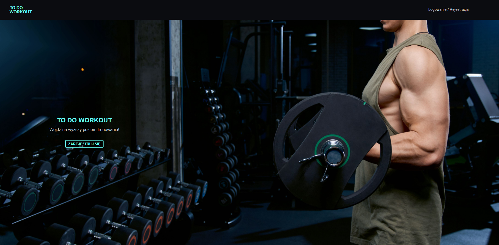
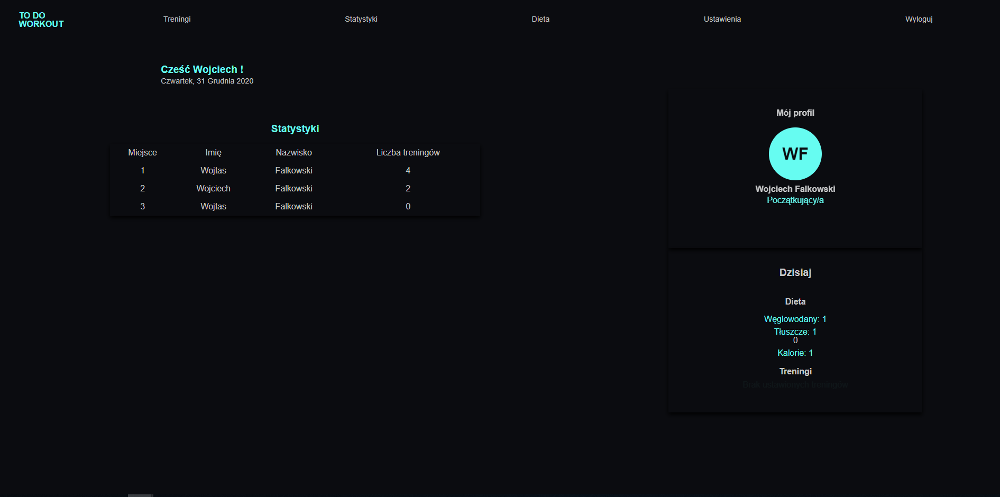
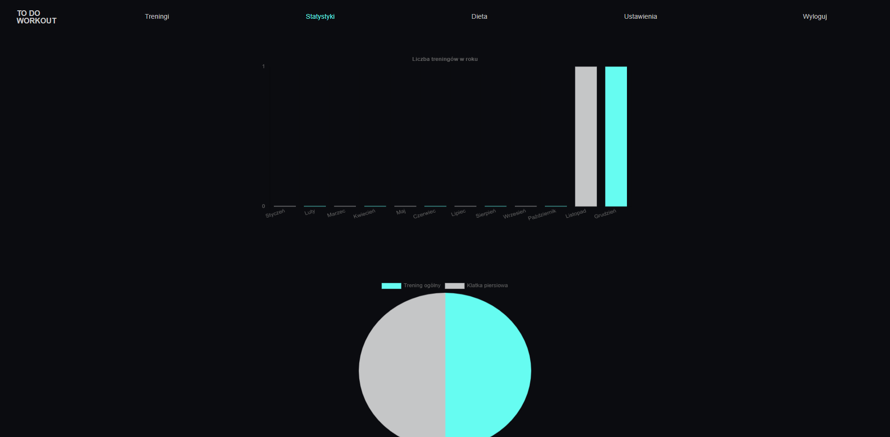
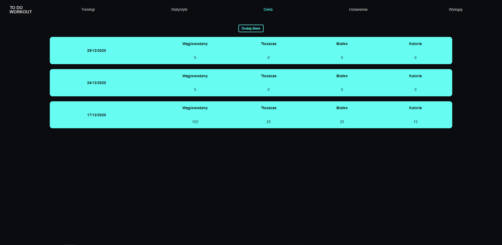
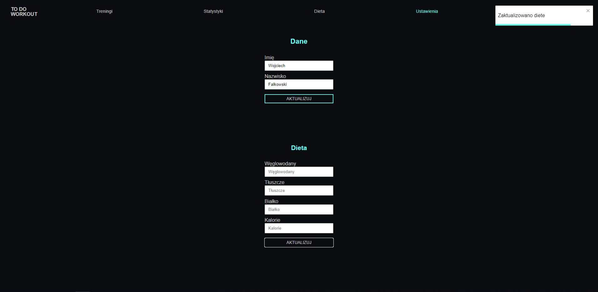

# Workout App React

### Technologies used:

### Screenshots:

### Folders structure

- **styles**
  Includes global styles setup, mixins, theme palette, reset styles and palette definition for ts files usage
- **components**
  Includes components which are reused between screens like `form fields` or `buttons`, `charts`.
- **core**
  Contains things that are critical to the application. Such as authorization module.
- **utils**
  Contains helper functions, custom hooks and etc...
- **pages**
  Contains completely independent folders. Each of them is a separate module. This folders basicaly contain app pages.
